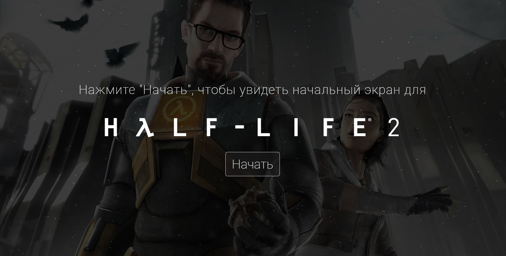
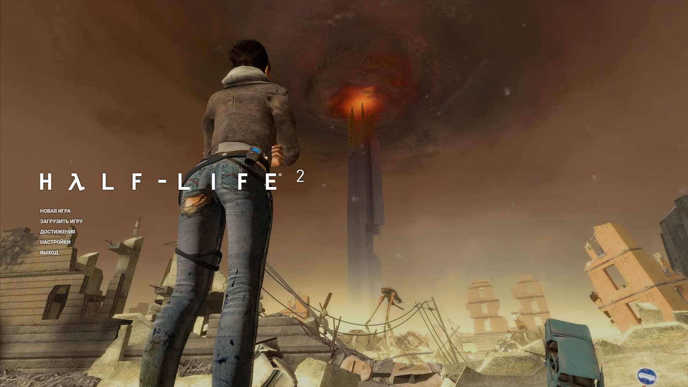

<h1 align="center">Half-Life 2 Starting Screen</h1>
<p align="center">
  Made with <code>HTML</code>, <code>SCSS</code>, <code>TypeScript</code>, <code>ReactJS</code>, <code>CSS Modules</code>
  <br>
  Bootstrapped with <code>Vite</code>
</p>

<p align="center">
  <a href="../../actions"></a>
  <a href="../../commits"></a>
  <a href="./LICENSE"></a>
  
  
</p>

<p align="center">
  <a href="#-screenshots">🖼 Screenshots</a> • 
  <a href="#ℹ%EF%B8%8F-about">ℹ️ About</a> • 
  <a href="#%EF%B8%8F-tools">⚙️ Tools</a> • 
  <a href="#-build-project">🔨 How to Build Project</a> • 
  <a href="#-file-structure">📁 File Structure</a>
</p>

<sup>
  <p align="center">
    <a href="#-npm-packages-worth-mentioning">📦 NPM Packages worth mentioning</a> • 
    <a href="#-details">💡 Details</a> • 
    <a href="#-useful-resources">🔗 Useful resources</a> • 
    <a href="#-author">👤 Author</a>
  </p>
</sup>

## 🖼 Screenshots

<p align="center">
  
</p>

<p align="center">
  
</p>

<p align="center">
  
</p>

<p align="center">
  
</p>

<p align="center">
  
</p>

<p align="center">
  
  
</p>

<p align="center">
  
  
</p>

<p align="center">
  
  
</p>

<p align="center">
  
  
</p>

<p align="center">
  
  
</p>

<p align="center">
  
  
</p>

## ℹ️ About

I like Half-Life 2, that's why I decided to create this little project.

Figma prototype: https://www.figma.com/file/Y2NWcAo1npsghs4AzJorHJ/Half-Life-2-Intro-Screen?type=design&mode=design

It a lot of time to re-create the Half-Life 2 screen in Figma. Quite a lot, really.

## ⚙️ Tools

- **HTML5**
- **CSS**
  - CSS Modules
  - SASS/SCSS
- **TypeScript**
  - ReactJS
- **Github Pages**

## 🔨 Build project

<table>
  <tr>
    <th>Command</th>
    <th>Description</th>
  </tr>
  <tr>
    <td><code>npm&nbsp;install</code></td>
    <td>First things first, install all required packages</td>
  </tr>
  <tr>
    <td><code>npm&nbsp;run&nbsp;dev</code></td>
    <td>Run the app in development mode</td>
  </tr>
  <tr>
    <td><code>npm&nbsp;run&nbsp;test</code></td>
    <td>Run unit tests (there is only one set of test cases for one function...)</td>
  </tr>
  <tr>
    <td><code>npm&nbsp;run&nbsp;build</code></td>
    <td>Build the app</td>
  </tr>
  <tr>
    <td><code>npm&nbsp;run&nbsp;preview</code></td>
    <td>Run the app in production mode</td>
  </tr>
  <tr>
    <td><code>npm&nbsp;run&nbsp;lint</code></td>
    <td>Check compliance with Eslint rules</td>
  </tr>
</table>

## 📁 File Structure

```Markdown
├── 📁 .github
|   ├── 📁 workflows
|   |   └── 📝 main.yaml      CI/CD instructions for Github Actions
│   └── 📝 dependabot.yml     Instructions for Dependabot
|
├── 📁 docs                   Additional information, documentation
│   └── 📁 results            Screenshots of how the application works after being fully developed
|
├── 📁 src                    Source files needed for application development
│   ├── 📁 assets             Static assets: images, icons, favicons
|   |   ├── 📁 achievements   Achievements images
|   |   ├── 📁 background     Backround images for the half life screen
|   |   ├── 📁 chapters       Chapter preview images
|   |   ├── 📁 fonts          Fonts used
|   |   ├── 📁 icons          Icons used
|   |   ├── 📁 sounds         Sound effects, music
|   |   ├── 📝 half_lify_guy.mp4  Video with the Valve guy
|   |   └── 📝 mainBg.jpg     Background image for the intro page
|   |
│   ├── 📁 components         React components
|   |   └── 📁 ComponentName
|   |       ├── 📝 index.tsx           Component logic
|   |       ├── 📝 index.module.scss   (optional) Component styles
|   |       ├── 📝 index.types.tsx     (optional) Component types
|   |       ├── 📝 hooks.tsx           (optional) Custom hooks used only in this component
|   |       ├── 📝 utils.ts            (optional) Custom utility functions used only in this component
|   |       └── 📝 other files         Other additional files
|   |
│   ├── 📁 hooks              Custom React hooks
|   |
│   ├── 📁 localization       Files required for localization
|   |   ├── 📁 locales        Files with translations
|   |   ├── 📝 i18n.ts        Initializes i18n
|   |   ├── 📝 languages.ts   List and types of languages
|   |   ├── 📝 resources.ts   Converts files from `locales` folder into i18n format
|   |   └── 📝 transformToI18nFormat.ts   Converts JS objects into i18n format
|   |
│   ├── 📁 pages              React components for pages
|   |   └── 📁 PageName
|   |       ├── 📝 index.tsx           Page logic
|   |       ├── 📝 index.module.scss   Page styles
|   |       ├── 📝 index.types.tsx     (optional) Page types
|   |       └── 📝 _other files_       Other additional files
|   |
│   ├── 📁 utils              Utility functions
|   |
│   ├── 📝 App.tsx            App React component
│   ├── 📝 App.module.scss    (optional) App styles
│   ├── 📝 fonts.scss         Fonts definition
│   ├── 📝 index.html         Main html file
│   ├── 📝 index.scss         Global styles
│   ├── 📝 index.tsx          Entry point for the module bundler
│   └── 📝 vite-end.d.ts      Some Typescript stuff for Vite
|
├── 📝 .eslintrc.cjs          ESLint configuration file
├── 📝 .gitignore             Instructions for Git about what files to ignore
├── 📝 LICENSE                MIT License. Basically you can do whatever you want with the code
├── 📝 package-lock.json      Keeps track of the exact version of every package that is installed
├── 📝 package.json           Various metadata relevant to the project, scripts, dependencies
├── 📝 README.md              Project description
├── 📝 tsconfig.json          TypeScript configuration file
├── 📝 tsconfig.node.json     TypeScript configuration file for Vite
└── 📝 vite.config.js         Vite configuration file
```

## 📦 NPM Packages worth mentioning

<table>
  <tr>
    <td><code>i18next</code>, <code>react-i18next</code></td>
    <td>For localization</td>
  </tr>
  <tr>
    <td><code>tsparticles</code>, <code>react-tsparticles</code></td>
    <td>Good looking moving particles</td>
  </tr>
  <tr>
    <td><code>clsx</code></td>
    <td>For conditional lists of CSS classes</td>
  </tr>
  <tr>
    <td><code>react-draggable</code></td>
    <td>Allows to move elements with a mouse</td>
  </tr>
  <tr>
    <td><code>sass</code></td>
    <td>Mainly for using nesting, mixins, static variables in CSS</td>
  </tr>
  <tr>
    <td><code>vitest</code></td>
    <td>For unit tests</td>
  </tr>
</table>

## 💡 Details

### Flickering Fonts

Do you know that nasty effect: when you load a page you see default browser fonts that change to the correct ones in 1-2 seconds after you see the content? I do and I hate it. Luckily I found the way how to avoid it: preload the fonts

For custom fonts you have to add in `index.html` the following:

```html
<link
  rel="preload"
  href="./assets/fonts/Half Life 2/halflife2.ttf"
  as="font"
  type="font/ttf"
  crossorigin="anonymous"
/>
```

for Google fonts (use Network tab to get that link below):

```html
<link
  rel="preload"
  href="https://fonts.gstatic.com/s/roboto/v30/KFOlCnqEu92Fr1MmWUlfABc4EsA.woff2"
  as="font"
  type="font/woff2"
  crossorigin="anonymous"
/>
```

It makes the html file a bit messy, but I asked one experienced frontend developer and she said that it's fine and that's a standard way to preload the fonts.

### Intro

Used `tsparticles` in the intro screen for better visual aesthetics. Here is how I intergrated that into the solution:

```tsx
<Particles
  id="tsparticles"
  init={particlesInit}
  options={tsparticlesConfig}
  style={{
    opacity: 0.75,
    pointerEvents: "none",
  }}
/>
```

I played for some time with configuration file, but in the end decided that it's better not to change the default config in any drastic way.

### Page transition

Read about `Suspense` component in the new React docs and decided to use it. So the transition from page to page looks smoother thanks to this component. While the files are uploading I'm showing a gif of moving gears. In order for the `Suspense` to properly work I had to lazily import the page components.

It's not absolutely smooth, but it's better than nothing.

```tsx
const IntroScreen = lazy(() => import("./pages/IntroScreen/index.tsx"));
const ValveGuyVideo = lazy(() => import("./pages/ValveGuyVideo/index.tsx"));
const HalfLifeScreen = lazy(() => import("./pages/HalfLifeScreen/index.tsx"));

const App: React.FC = () => {
  const [stepShown, setStepShown] = useState(1);
  const nextStepHandler = () => setStepShown((prev) => prev + 1);

  return (
    <>
      {stepShown === 1 && (
        <Suspense fallback={<Spinner />}>
          <IntroScreen nextStepHandler={nextStepHandler} />
        </Suspense>
      )}
      {stepShown === 2 && (
        <Suspense fallback={<Spinner />}>
          <ValveGuyVideo nextStepHandler={nextStepHandler} />
        </Suspense>
      )}
      {stepShown === 3 && (
        <Suspense fallback={<Spinner />}>
          <HalfLifeScreen />
        </Suspense>
      )}
    </>
  );
};
```

Also this trick allowed to reduce the initial rendering time, although I didn't calculate the difference.

### Image gallery

The most difficult part was to create a gallery of images that change one another after set time. Tried to find an appropriate library but failed, so I had to do it from scratch. Also I did some optimization fixes so this gallery may consist of hundreds or even thousands of photos and not lag.

When the image has `display: none` and `loading: lazy` (tried to remove `lazy`, but it's better with `lazy` on), the browser doesn't download it from the server. Thus I marked images that aren't gonna be shown in the nearest time with these parameters.

Tested it on slow 3G with disabled caching and carefully watched the Network tab in Chrome with the gallery consisting of hundreds of images (deleted them later). Everyting worked as intended.

```ts
{
  imagesList.map((imageSrc, index) => (
    
  ));
}
```

I also added opacity transition so the images change one after another with fading in and out animation. Looks nice, but whenever I change settings the first 2-3 images change without any animation. Tried different ways to overcome this problem, but didn't succeed. That bug is minor, so it's not really important if it's remains unfixed.

It also took quite some time in order to come up with the way of shuffling the images, so on every page refresh they might observer another sequence of images.

### Settings

Well, you basically can:

- Change the sets of the displayed background images
- Set the time between illustration swapping
- Set the language of the interface
- Choose the background music
- Set the volume of the sound effects
- Set the volume of the background music
- Inputs

The settings are stored in `localStorage`, so they persist after page refreshes.

Initially I try to take the initial language using `navigator`, if it's not present in `localStorage`

```ts
export const savedLanguage: ChosenLanguageType =
  JSON.parse(localStorage.getItem("settingsState") ?? "null")?.chosenLanguage ??
  (navigator.language === "ru-RU" ? "Русский" : "English");
```

The rules are quite simple, because there are only 2 languages.

### Localization

As an icing on a cake I decided to add localization to the project. One may choose between Russian and English languages. Found out that I18n is the most popular library for that purpose, read docs, watched some videos and used the library in the project.

I had some hands-on experience with localization during my work, they used the standard approach that looked like this:

```js
{
  en: {
    newGame: 'New Game',
    loadGame: 'Load Game',
    tabs: {
        graphics: 'Graphics',
        audio: 'Audio'
    }
  },
  ru: {
    newGame: 'Новая игра',
    loadGame: 'Загрузить игру',
    tabs: {
        graphics: 'Графика',
        audio: 'Аудио'
    }
  }
}
```

That's the style that you have to use in i18n. I don't like it, because:

- You must duplicate the key names. That's quite tedious
- If you group translations, you must duplicate group names either. The same problem
- Translations may lie very far away from one another
- It's challenging to split the translations in separate files

What I did is used this structure for translations:

```js
const settings = convertToI18nFormat({
  modalName: {
    en: "Settings",
    ru: "Настройки",
  },
  graphics: {
    tabName: {
      en: "Graphics",
      ru: "Графика",
    },
    displayedPacs: {
      en: "Sets of displayed illustrations",
      ru: "Наборы отображаемых иллюстраций",
    },
    illustrationChangeTimer: {
      en: "Timer for changing illustrations in sec.",
      ru: "Таймер смены иллюстраций в сек.",
    },
    langSwitcher: {
      en: "Language",
      ru: "Язык",
    },
  },
  // ...
});
```

It's easy to maintain, nice to look at, and it stores all translations for the same key in one place. It's also easy to scale in case you have more than 2 languages

Then I converted this structure into i18n-like with the function `convertToI18nFormat`. What's left is to import that piece of translations and insert it into the `resources` that's passed down to i18n:

```ts
const getLocale = (lang: LanguageType): TranslationObject => ({
  intro: { ...intro[lang] },
  menu: { ...menu[lang] },
  settings: { ...settings[lang] },
  chapters: { ...chapters[lang] },
  achievementsList: { ...achievementsList[lang] },
  newGame: { ...newGame[lang] },
  loadGame: { ...loadGame[lang] },
  achievements: { ...achievements[lang] },
  quit: { ...quit[lang] },
});

const resources: ResourcesType = {
  en: {
    translation: {
      ...getLocale("en"),
    },
  },
  ru: {
    translation: {
      ...getLocale("ru"),
    },
  },
};
```

The code above helps to reduce code duplication to bare minimum. I'll admit that it required quite some time and effort to make it properly work with TS, but I'm satisfied with the result.

The code structure allows to add even more additional languages without having to rewrite everything.

### Background music and video

There are issues in Chrome with the inability to autoplay sounds and videos without prior user interaction. That's why I had to add a separate screen with a giant button "Start" in order for autoplay to work properly. A user presses the button, and that counts as a valid interaction.

```tsx
<video
  ref={videoRef}
  className="bgImage"
  onEnded={nextStepHandler}
  preload="auto"
  playsInline
>
  <source src={hl_guy} type="video/mp4" />
</video>
```

Changing the `key` helps to switch the tracks on fly. Very convenient.

```tsx
<audio ref={audioRef} loop autoPlay key={audioType}>
  <source src={audioMap[audioType]} type="audio/mpeg" />
</audio>
```

### UI Sounds

I used this code. It helps to avoid refetching the same resource over and over again.

```ts
async function loadAudio(url: string) {
  // not using try, catch, because I request only local files and they are guaranteed to fetch
  const response = await fetch(url);
  const blob = await response.blob();
  const fileBlob = URL.createObjectURL(blob);
  const audio = new Audio(fileBlob);
  return audio;
}
```

I turned off caching, used slow 3g in the Network tab of Chrome and it worked fine with the code above. Although... I suppose no one really disables caching... so there is not much point in that optimizations. So it is what it is. True and real.

Also I wanted to allows users to play the same sound multiple times whenver they press a menu option. To achieve that I had to clone the node:

```tsx
const soundMap = {
  hover: await loadAudio(hoverSoundSrc),
  click: await loadAudio(clickSoundSrc),
  death: await loadAudio(deathSoundSrc),
  friedNails: await loadAudio(friedNailsSoundSrc),
};

const chosenSound = soundMap[type];
const soundCopy = chosenSound.cloneNode() as HTMLAudioElement;
```

And in order to use upper level await I had to use the latest JS version to compile to...

### Image Optimization

Previously I used tinypng for optimizing the images sizes. Although I stumbled upon another service called Squoosh. It allowed me to reduce the size by up to 90-95% without losing image quality. Sounds like magic? It did for me, until I tried it and saw the effect with my own eyes!

You may install it locally. The only downside is that you may only pass 1 photo in their application. But! They have a Github repository that must in theory help to automate this process. I was too lazy to do that, might probably try that in the future.

Official website: https://squoosh.app/
Github: https://github.com/GoogleChromeLabs/squoosh

### Miscellaneous

It took quite some time to re-create custom interface components so they look exactly like in Half-Life 2

I talk about

- Checkboxes
- Radio buttons
- Buttons
- Tabs in settings
- Modal windows

In fact, it was much more challenging to draw them in Figma, rather than program them. As soon as you discover the way how to draw that, you immediately understand how to code that.

Also here is a way how to open something in a new tab, if you for some reason don't use the anchor <a> tag:

```js
window.open(url, "_blank", "noopener,noreferrer");
```

You may add aliases in vite.config to help Vite resolve dependencies:

```ts
export default defineConfig({
  root: "src",
  base: "./",
  publicDir: "../public",
  resolve: {
    alias: {
      "@": path.resolve(__dirname, "src"),
    },
  },
  // ...
});
```

## 🔗 Useful resources

- [HTML, CSS, JS | Half-Life 2 Main Menu Replica (Quick Tutorial)
  ](https://www.youtube.com/watch?v=rIA2wlXkvQo&t=20s) - Tutorial that helped me to add UI sounds on user interactions. Also it provided links to the resources where I could download those sounds
- [Прохождение игры Half-Life 2
  ](https://hl-inside.me/hl2/) - Assets for chapters preview, names of chapters in russian, achivement names and description in Russian
- [The Half-Life & Portal Encyclopedia](https://half-life.fandom.com/) - Same but in English
- [i18n official docs](https://www.i18next.com/) - Official i18n docs
- https://squoosh.app/ - Awesome image optimization tool

## 👤 Author

- Frontend Mentor - [@GrbnvAlex](https://www.frontendmentor.io/profile/GrbnvAlex)
- Telegram - [@Arlagonix](https://t.me/Arlagonix)
- Github - [@arlagonix](https://github.com/arlagonix)
